### Pharmaceutical-Test-Analysis
#### <i> An analysis of an experimental drug regimen</i>

----------------------

**Description:**

I cleaned a dataset by removing duplicate and incomplete entries. I then analyzed the dataset using statistical summaries and creating helpful charts.

<b>Datasets used:</b>

* [Mouse Metadata](data/Mouse_metadata.csv)

* [Study Results](data/Study_results.csv)

### Tools used:
----------------------

  - Python
  - Matplotlib
  - Pandas
  - Scipy
  - Numpy
  - Jupyter

### Analysis:
----------------------

* Checked the data for any mouse ID with duplicate time points and removed any data associated with that mouse ID.

* Generated a summary statistics table consisting of the mean, median, variance, standard deviation, and SEM of the tumor volume for each drug regimen.

* Generated a bar plot using both Pandas's `DataFrame.plot()` and Matplotlib's `pyplot` that shows  the number of total mice for each treatment regimen throughout the course of the study.

* Generated a pie plot using both Pandas's `DataFrame.plot()` and Matplotlib's `pyplot` that shows the distribution of female or male mice in the study.

* Calculated the final tumor volume of each mouse across four of the most promising treatment regimens: Capomulin, Ramicane, Infubinol, and Ceftamin. 

* Calculated the quartiles and IQR and quantitatively determine if there are any potential outliers across all four treatment regimens.

* Generated a box and whisker plot of the final tumor volume for all four treatment regimens and highlight any potential outliers in the plot by changing their color and style.

* Generated a line plot of tumor volume vs. time point for a mouse that was treated with Capomulin.

* Generated a scatter plot of mouse weight versus average tumor volume for the Capomulin treatment regimen.

* Calculated the correlation coefficient and linear regression model between mouse weight and average tumor volume for the Capomulin treatment.

###  Data Visualization:
----------------------

#### Summary Statistics
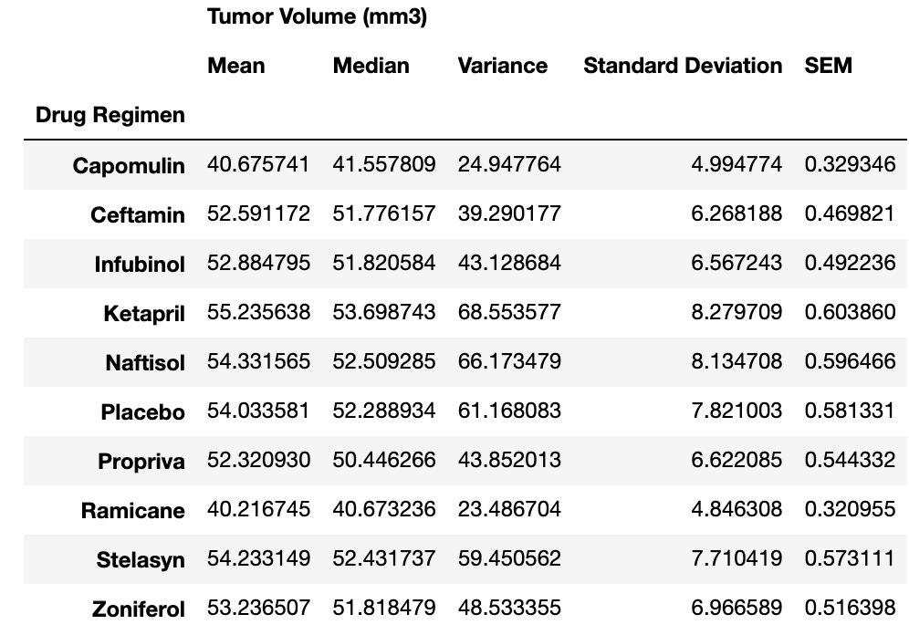

#### Pandas Bar Plot
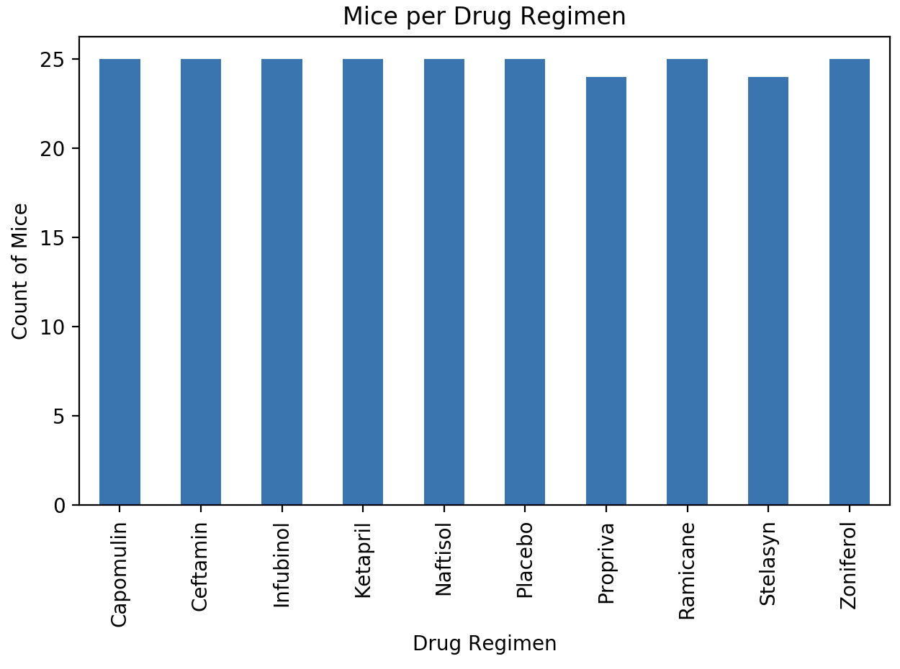

#### Matplotlib Bar Plot
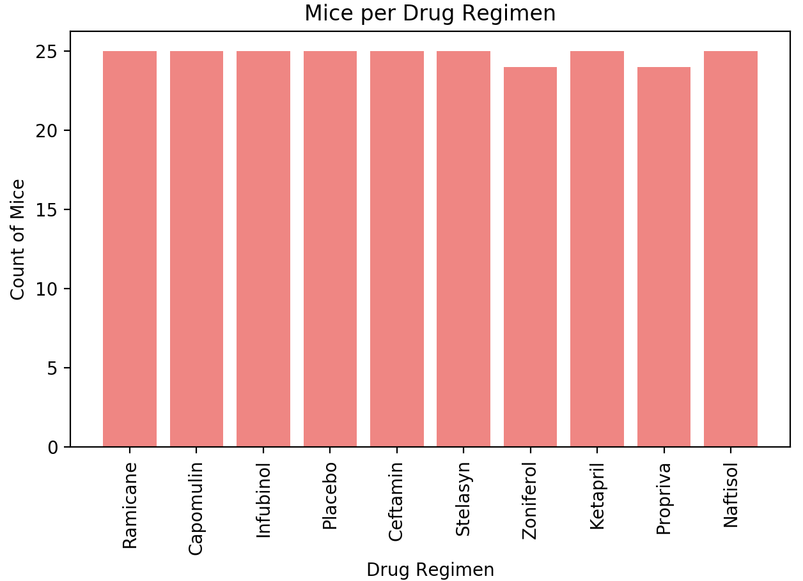

#### Pandas Pie Plot
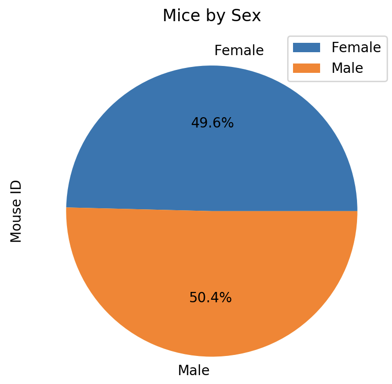

#### Matplotlib Bar Plot
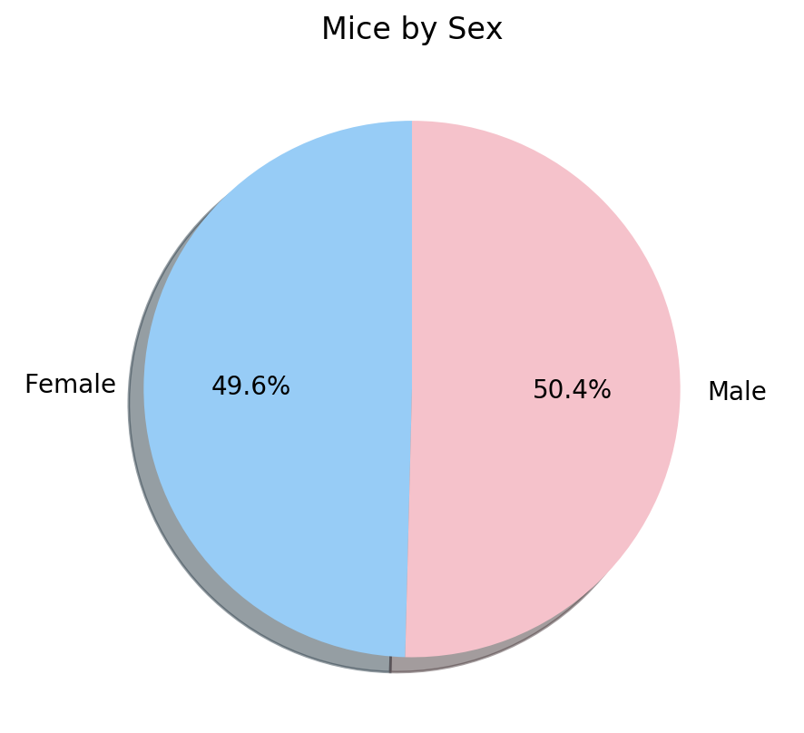

#### Final Tumor Volume by Drug Regimen
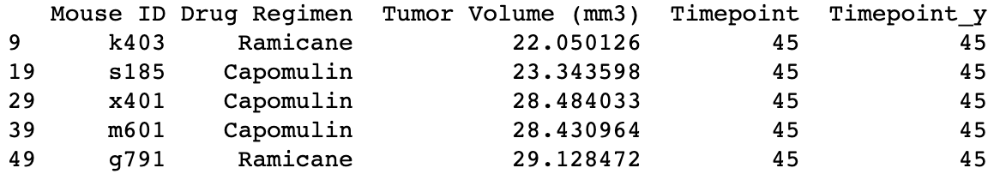

#### Quartiles for Drug Regimens
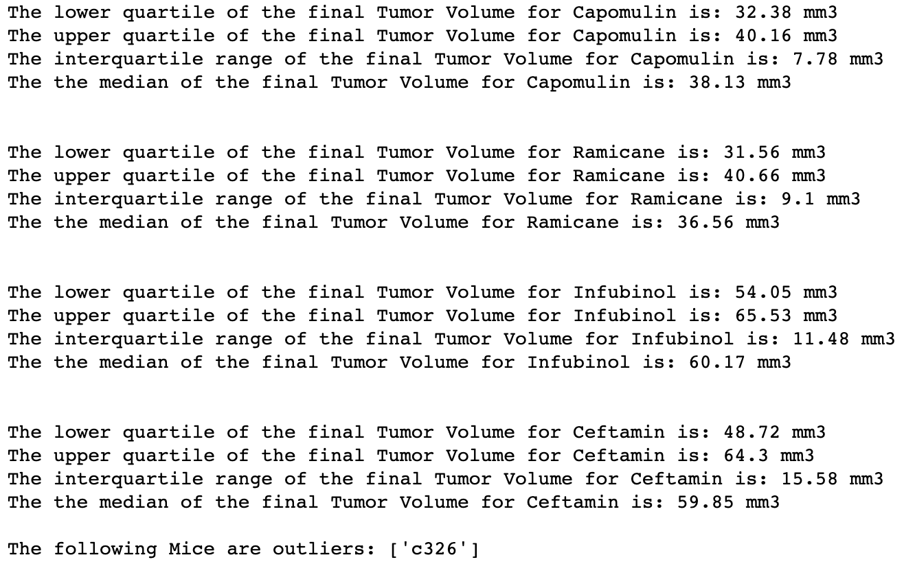

#### Box and Whisker Plot
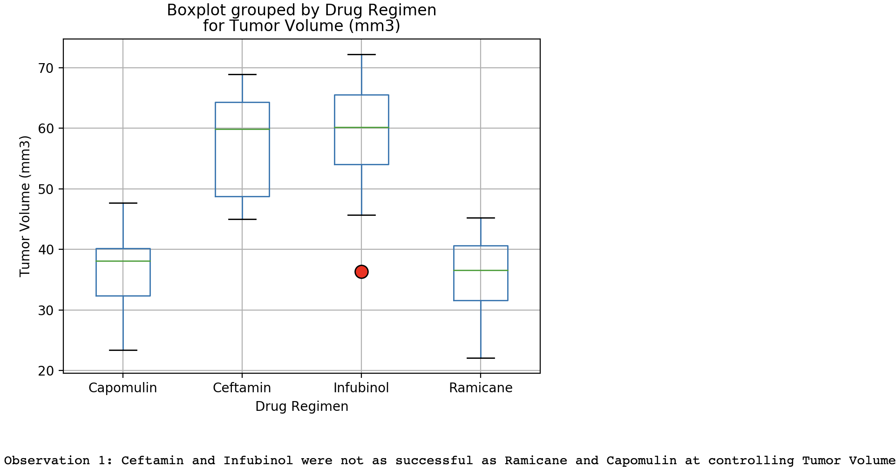

#### Line Plot
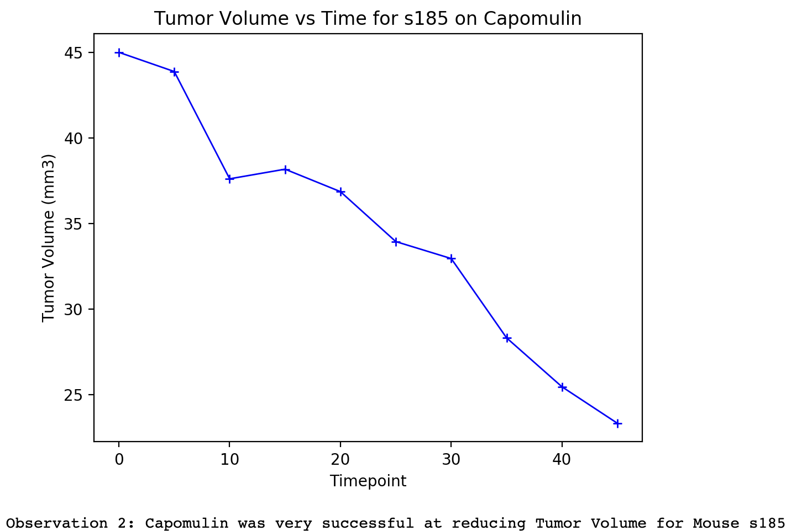

#### Scatter Plot
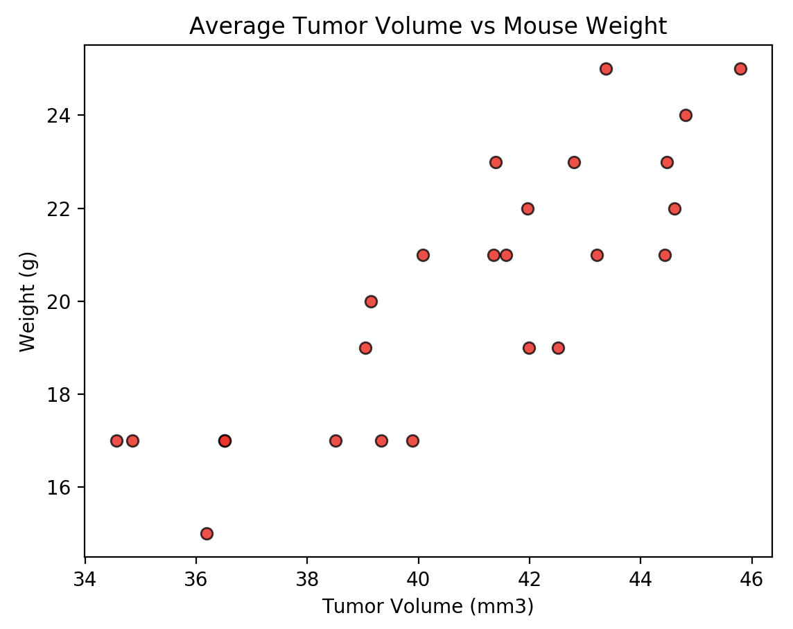

#### Correlation and Regression Plot
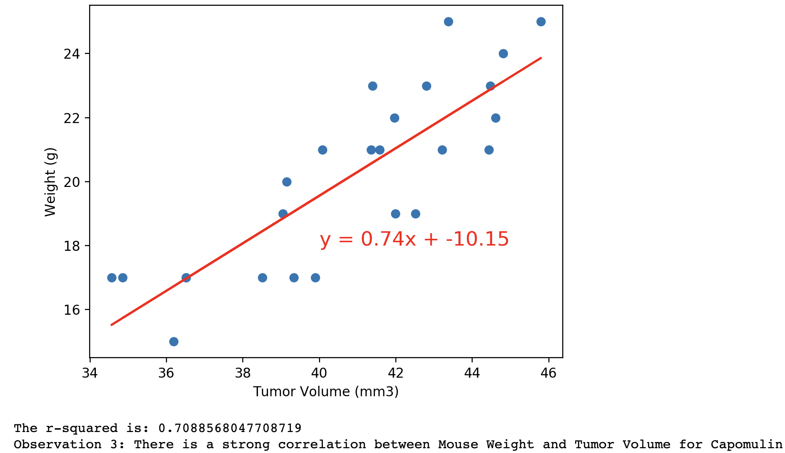